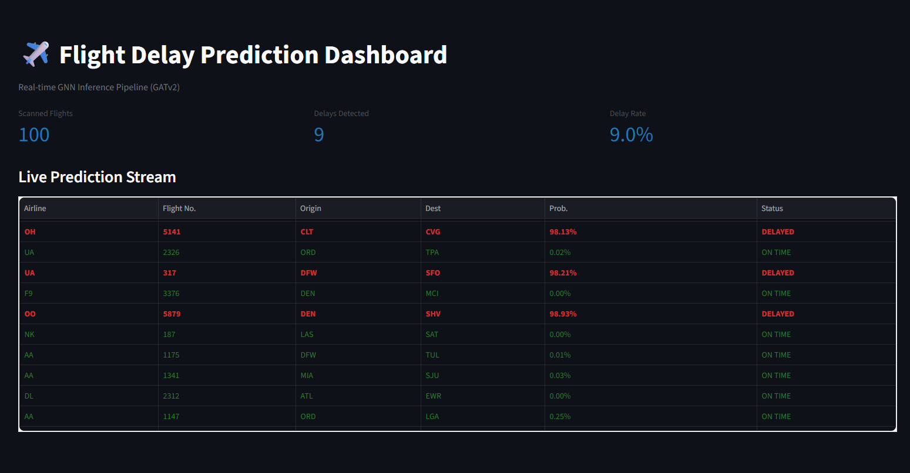
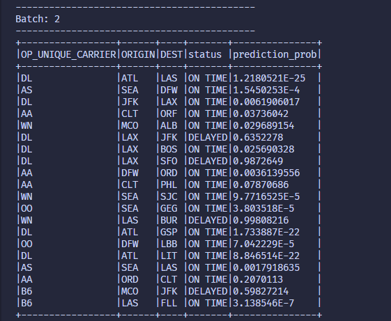

# Flight Delay Prediction GNN System

A real-time flight delay prediction system using **Graph Attention Networks (GATv2)**, integrated with a big data infrastructure including **Kafka, Spark Streaming**, and **Cassandra**.

## Project Overview

This project tackles the flight delay prediction problem by modeling the airport network as a dynamic graph. Weather conditions and flight schedules are propagated through graph edges (flights) to predict delay probabilities as soon as new data enters the system.

### Key Features

- **Real-time Inference:** Low-latency predictions using Kafka and Spark Streaming.

- **GNN Architecture:** Implements GATv2 to learn spatial-temporal relationships between airports, enabling the model to focus on critical nodes that contribute to cascading delays in the aviation network.

- **Scalable Archiving:** Historical data is stored in Cassandra for model retraining and long-term analysis.

- **Monitoring Dashboard:** Real-time visualization of prediction results via Streamlit.

---

## System Architecture

The system follows a **Kappa Architecture** combined with an MLOps workflow:

1. **Ingestion Stream:** CSV data is published to Kafka topics as streaming events.

2. **Real-time Inference Stream:**
   - **Python Engine:** Designed for fast, per-record inference.
   - **Spark Engine:** Performs large-scale parallel inference using **PySpark UDFs**.

3. **Archiving Stream:** Spark Streaming consumes Kafka data and persists it into Cassandra.

4. **Training Stream:** Data is retrieved from Cassandra to rebuild the graph (Graph Builder) and update model weights.

---

## Directory Structure

```plaintext
.
├── configs/          # System configuration (YAML)
├── data/             # Raw & processed datasets
├── notebooks/        # GNN research & experimentation
├── src/
│   ├── dashboard/    # Streamlit dashboard UI
│   ├── features/     # Graph construction & preprocessing
│   ├── models/       # GATv2 architecture definitions
│   ├── pipelines/    # Ingest, archive, inference, training pipelines
│   └── config_loader.py
├── state/            # Model weights, encoders & realtime states (.pth, .pkl)
└── Makefile          # System command orchestration
````

---

## Usage Guide

The system is centrally controlled via the `Makefile`.

### 1. Environment Setup

```bash
make help
```

### 2. Real-time Pipeline (Open 3 Terminals)

* **Terminal 1 (Ingest):** Publish data into Kafka.

```bash
make ingest
```

* **Terminal 2 (Inference):** Run the GNN inference engine.

```bash
make inference-py
```

* **Terminal 3 (Dashboard):** Launch the web dashboard.

```bash
make dashboard
```

* **Distributed Spark Inference:**

```bash
make inference-spark
```

*Note: The Spark inference pipeline is optimized for high-throughput batch processing and currently runs independently from the Streamlit dashboard.*

### 3. Archiving & Retraining

* **Archive data into Cassandra:**

```bash
make archive
```

* **Retrain the model:**

```bash
make train
```

---

## Experimental Results

### Real-time Dashboard

Displays real-time delay probabilities for each flight.



### Spark Streaming Output

Parallel inference results processed by the Spark driver.



---

## Technology Stack

* **Deep Learning:** PyTorch Geometric (PyG), GATv2
* **Big Data:** Apache Kafka, Apache Spark, Cassandra
* **DevOps:** Docker, Makefile, UV (Python Package Manager)
* **Visualization:** Streamlit, Pandas
